金工专题报告

2026 年 02 月 02 日

## 证券分析师

杨怡玲

SAC: S1350525090004

yangyi ling@huayuanstock.com

陶文启

SAC: S1350525100001

taowenqi@huayuanstock.com

## 联系人

# 基于稀疏自编码器的指数择时模型 ——量化择时系列研究之一

## 投资要点:

本文基于指数量价数据使用稀疏自编码器模型搭建了一套宽基指数的择时模型，数据预处理阶段, 模型通过对时间序列数据进行小波变换降低数据中的噪声含量。模型训练阶段, 我们通过给自编码模型的损失函数上添加自回归损失和稀疏化惩罚达到以下目标:1)模型能够自助进行特征筛选和信息提纯；2)提高模型鲁棒性和抗过拟合能力；3)模型能够较好的学习到指数涨跌的“真实”规律。

通过绘制损失函数变化曲线以及不同随机种子产生信号相关系数矩阵，我们可以得出:1)虽然局部损失函数值有一定的波动，但是全局来看损失函数下降过程较为平滑, 这个结果说明整个训练过程较为稳定; 2) 所有随机种子的预测值两两相关性大部分都在 70%以上，相对较高，但最低相关性仅仅只有 59.48%，说明模型存在一定的随机性, 但随机性对模型最终结果的影响可能有限。

根据合成信号在样本外的表现我们可以得出结论:1)指数的多空信号切换频率和市场环境关联较大，指数单边行情的时候，模型信号不容易发生切换，而指数震荡行情下，模型信号切换频率较高；2)由于我们在构建信号的时候，我们发现设定适当的阈值有助于提升策略的稳定性，并且也能大幅降低策略的换手次数；3)各个宽基指数上策略的多空收益来源相对较为均衡, 只做多和只做空年化收益相差不大, 策略收益并不会大部分单纯来源于做多或做空; 4) 策略日度胜率相对较低，但策略绝对收益较高, 这说明策略可能是获得了一个较高的赔率; 5) 策略可能在市值更小的宽基指数上表现更好。

模型在中证 500、中证 1000、中证 2000 和中证全指上均有较好的业绩表现，各年度多空策略以及只做多策略收益均为正, 其中中证 500 和中证 1000 多空策略年化收益分别为 43.86% 和 51.21%，中证 500、中证 1000、中证 2000 和中证全指只做多策略收益分别为 23.30%、26.00%、32.56%、18.83%。

风险提示:1)量化模型基于历史数据分析，未来存在失效风险，建议投资者紧密跟踪模型表现。2)极端市场环境可能对模型效果造成剧烈冲击，导致收益亏损。

## 内容目录

1. 研究背景 .4

2. 择时模型简介 .5

2.1. 稀疏自编码 (SAE) 模型简介 .5

2.2. 输入特征说明 .6

2.3. 小波变换去噪 .7

3. 模型训练稳定性与随机性分析 .8

3.1. 模型训练稳定性分析 .8

3.2. 模型随机性影响 .8

4. 策略样本外绩效表现 .9

4.1. 中证 500 指数绩效表现 .9

4.2. 中证 1000 指数绩效表现 12

4.3. 其他宽基指数上的绩效表现 .14

5. 结论 16

6. 参考文献 .17

7. 风险提示 .17

## 图表目录

图表 1: 稀疏自编码模型结构 .5

图表 2: 增量训练过程示意图 .6

图表 3:损失函数变化曲线(横坐标表示迭代 epoch，纵坐标为损失值) .8

图表 4: 不同 seed 预测值的相关性情况 .9

图表 5: 中证 500 多空信号分布 (回测区间 20200101~20251231) 10

图表 6: 中证 500 多空信号分布 (回测区间 2020010~20251231) 10

图表 7: 中证 500 多空策略分年度表现 (回测区间 20200101~20251231) 10

图表 8: 中证 500 多空策略净值走势 (回测区间 20200101~20251231) .11

图表 9: 中证 500 只做多绩效表现 (回测区间 20200101~20251231) .11

图表 10: 中证 500 只做空绩效表现 (回测区间 20200101~20251231) .11

图表 11: 中证 500 只做多净值走势 (回测区间 20200101~20251231) .11

图表 12: 中证 500 只做空净值走势 (回测区间 20200101~20251231) .11

图表 13: 中证 1000 多空信号分布 (回测区间 20200101~20251231) 12

图表 14: 中证 1000 多空信号分布 (回测区间 20200101~20251231) 12

图表 15: 中证 1000 多空策略分年度表现 (回测区间 20200101~20251231) 13

图表 16: 中证 1000 多空策略净值走势 (回测区间 2020010~20251231) .13

图表 17: 中证 1000 只做多绩效表现 (回测区间 20200101~20251231) .13

图表 18: 中证 1000 只做空绩效表现 (回测区间 20200101~20251231) .13

图表 19: 中证 1000 只做多净值走势 (回测区间 20200101~20251231) .14

图表 20:中证 1000 只做空净值走势(回测区间 2020010 1~20251231) .14

图表 21: 各宽基指数择时策略汇总表现 (回测区间 20200101~20251231) .14

图表 22: 中证 2000 只做多绩效表现 (回测区间 2020010 1~20251231) .14

图表 23: 中证全指只做多绩效表现 (回测区间 20200101~20251231) 14

图表 24: 中证 2000 只做多净值走势 (回测区间 2020010~20251231) .15

图表 25: 中证全指只做多净值走势 (回测区间 20200101~20251231) 15

## 1. 研究背景

关于股票指数的量价择时策略，各种研究报告中对其已经有过一定程度的探讨，这些策略总体可分为以下几类:

1) 各种均线及其衍生策略，这种策略主要是根据指数本身价格的不同周期均线进行组合形成相应的买卖点, 该种策略存在以下问题:

- 被动地应对行情，并未对市场进行预测和验证，因此胜率较低；

- 本质上是趋势跟踪, 在拐点来到时反应较为迟钝;

- 如果是日频级别的技术分析，则过度依赖于市场状态，尤其在震荡市信号变换频率较大，会出现来回亏损的情况；

- 参数方面，容易出现过拟合，比如往往出现选择训练集最优参数，而在样本外失灵的情况。

2) 技术分析择时策略，该策略本质上是构建一些复杂的技术指标并进行线性融合从而对未来指数的涨跌情况进行预判，但该方法依然存在一些问题:

- 择时特征并不能像股票领域的截面 alpha 因子一样，贡献较为稳健的超额收益，在不同市场风格下，大多数择时特征的绩效表现会出现不同程度的波动，甚至出现失效的风险；

- 指数价格走势影响因素众多，各种因素之间的作用关系较为复杂，线性方法虽然简单，但是拟合程度也相应较低，无法刻画真实世界中的深度非线性关系，导致策略样本外预测的时候可能存在较大的欠拟合风险;

- 通过人工筛选指标的方式，最终使用的信息较少，在几百个指标中最后筛选出几个较好的指标，最后合成信号只利用到了这几个指标的信息，而剩下的指标仍有很多的信息尚未被利用。

3) 基于机器学习的择时策略，该策略主要是将指数的一些量价指标通过各类机器学习模型(如决策树、MLP 等)进行非线性拟合从而形成指数的涨跌信号，该方法虽然能捕捉一些人工方法难以捕捉的非线性关系, 但该方法也存在较多不足:

- 机器学习模型通常参数量较大，但择时任务通常数据量较小，因而模型可能产生较大的过拟合风险。

- 金融数据噪声含量较高，而一般的机器学习模型往往鲁棒性不足，因此模型很可能学习到一些噪声规律导致模型出现失效风险。

本质上, 我们面临的择时问题是特征压缩、信息筛选和时序预测相结合的问题, 这类问题是统计学中非常重要的领域, 近些年来, 以自编码模型(Auto Encoder, AE)和循环神经网络(Recurrent Neural Networks, RNN)为代表的深度学习(Deep Learning)模型发展迅速，由于其复杂的网络结构设计，拟合能力和特征提取能力远超传统机器学习模型，被大量运用在时间序列预测问题上。并且这些神经网络模型灵活度相对较高, 我们可以通过对其的损失函数和网络结构进行调整使得其能够更好的适应不同任务从而有更出色的表现。

基于上述情况，我们希望对 AE 和 RNN 模型进行一定的精细化设计，使得该模型能够对一些常见的宽基指数未来涨跌进行预测，并且希望新模型能够克服传统择时策略的不足。

## 2. 择时模型简介

由于指数择时任务数据量相对较少，而神经网络模型的参数量相对较高，因此对于使用的神经网络模型, 我们希望其能满足以下三条性质:

1. 模型能够自助进行特征筛选和信息提纯，择时特征通常在样本外绩效表现波动较大，人工方法很难界定各个特征的有效性，模型代替人工进行特征筛选可以有效的提升策略的泛化能力。

2. 模型自身鲁棒性强, 这样可以避免因数据量不足导致模型的过拟合风险。

3. 满足上述性质的同时，能够较好的学习到指数涨跌的 “真实” 规律。

### 2.1. 稀疏自编码 (SAE) 模型简介

一方面，由于涉及特征压缩任务，各类神经网络模型中自编码在这个任务中表现最为出色，另外一方面, 我们希望模型能够满足前文提到的三条性质, 因此我们对自编码模型进行改进提出了稀疏自编码模型 ( Sparse Auto Encoder, SAE)[1]。

SAE 模型主要分为两部分，稀疏自编码器与预测器，其中稀疏自编码器主要是对原始的高维特征进行压缩形成低维编码特征, 然后通过低维编码特征将原始特征进行还原, 一方面我们希望编码特征较为稀疏(稀疏化有助于过滤噪声和无效特征的影响)，另外一方面我们希望还原得到的特征与原始特征相似度高从而保证编码向量能够继承原始特征的大部分有效信息, 因此构建相应的损失函数的时候我们会设置自回归损失和稀疏惩罚两项。对于预测器，我们会将自编码层输出的隐藏层特征通过一个 Predictor 结构得到最终指数未来收益率的预测结果，因此该部分结构对应的损失函数我们设计为度量预测结果与真实标签之差。该模型具体形式如下图所示:

图表1:稀疏自编码模型结构

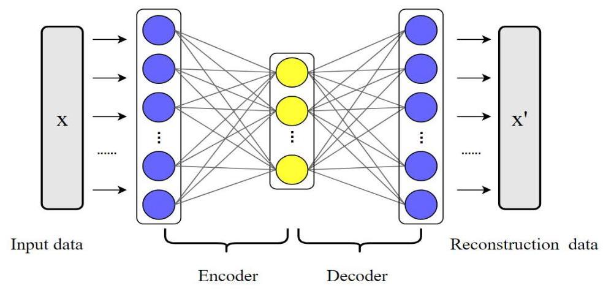

资料来源:华源证券研究所绘制

整个 SAE 模型的结构可表示为如下数学公式所示:

$$
{\operatorname{code}}_{i} = \operatorname{Encoder}\left( {x}_{i}\right) \text{ (编码层) }
$$

$$
{\widehat{x}}_{i} = \operatorname{Decoder}\left( {\operatorname{code}}_{i}\right) \text{ ( 解码层 ) }
$$

$$
{\widehat{y}}_{i} = \operatorname{Predictor}\left( {{re}{s}_{i}}\right) \text{ ( 预测器 ) }
$$

其中 ${x}_{i}$ 表示输入特征(Input data), ${\operatorname{code}}_{i}$ 表示 ${x}_{i}$ 的压缩编码, ${\widehat{x}}_{i}$ 表示重构特征 (Reconstruction data)，其维度与输入特征维度一致， ${re}{s}_{i}$ 表示隐藏层特征。该模型损失函数设计为:

$$
\operatorname{Loss} = \frac{1}{N}\mathop{\sum }\limits_{{i = 1}}^{N}\left( {\mathcal{J}\left( {{y}_{i},{\widehat{y}}_{i}}\right)  + {\lambda }_{1}\mathcal{L}\left( {{x}_{i},{\widehat{x}}_{i}}\right)  + {\lambda }_{2}\operatorname{SparseLoss}\left( {\operatorname{code}}_{i}\right) }\right)
$$

上述公式中 ${\lambda }_{1}$ 和 ${\lambda }_{2}$ 表示人为调节的权重系数为超参数，函数 $\mathcal{J}$ 和 $\mathcal{L}$ 分别表示向量和矩阵的距离度量函数 ( 如 MSE 损失、KL 散度等 ) , SparseLoss 表示稀疏化惩罚项, 我们通常使用向量范数或 KL 散度来做稀疏化惩罚项 [2], KL 散度的稀疏化损失公式如下:

$$
\mathop{\sum }\limits_{i}\left\lbrack  {\rho \log \frac{\rho }{{\rho }_{i}} + \left( {1 - \rho }\right) \log \left( \frac{1 - \rho }{1 - {\rho }_{i}}\right) }\right\rbrack
$$

其中 ${\rho }_{i}$ 表示整个 batch 样本中第 $i$ 个神经元的平均值, $\rho$ 表示稀疏化参数,该损失相当于把每一个神经元在不同样本上的取值视作为一个分布的随机数,通过让这个随机变量接近于取值为 1 的概率为 $\rho$ , 取值为 0 的概率为 $1 - \rho$ 的伯努利分布随机变量来保证编码向量的稀疏性。

整个模型每年滚动训练，每次训练取五组不同 seed 结果进行平均操作，根据平均信号放到样本外进行预测。训练采用增量训练方式如下图所示:

图表 2: 增量训练过程示意图

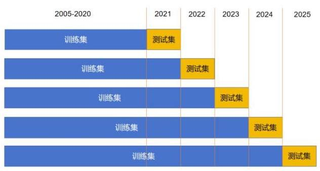

资料来源:华源证券研究所绘制

### 2.2. 输入特征说明

模型的输入端我们通常使用一些基于指数日 K 线字段 ( 高开低收、成交额、成交量 ) 构建的常见特征作为模型的输入，特征数量共计 92 个(包含时序滚动平均和特征之间的加减乘除操作得到的一些衍生指标)，这些特征总体可分为四个大类，具体如下:

- 基础 K 线量价字段:当日高开低收除以前收盘价，当日开盘价除以当日收盘价、换手率、 振幅以及它们的滚动 $\mathrm{N}$ 日平均值以及分位数等；

- 均线及均线相对位置指标:滚动 N 日均线、滚动 N 日均线相对滚动 M 日均线位置等；

- 波动率类指标:滚动 N 日收益率及换手率波动率等；

- 基础技术类指标:不同参数下的 RSI、OBV、MACD 等，其中

RSI 指标=(N 日内收盘涨幅绝对值之和)/(N 日内收盘跌幅绝对值之和)

OBV 指标=N 日内收盘涨跌的符号乘以换手率之和

MACD 指标计算方式如下:

DIF=12 日 EMA-26 日 EMA

DEA=DIF 的 9 日 EMA

MACD 指标=DIF-DEA

为了避免过拟合问题, 在构建数据集的时候我们对指标并没有做额外的筛选, 因此上述特征集可能并非最优。并且对于参数 $\mathrm{N}$ 我们通常取不同数值,从而使得截面特征能够尽可能多的包含长短时序信息。

### 2.3. 小波变换去噪

通常金融量价数据噪声含量较高，而神经网络模型通常参数量较大，当模型输入数据量不足的情况下, 容易引发较大的过拟合风险。因此, 我们借助小波变换的方法对时序数据进行分解重构, 进而达到数据去噪的目标。小波变换的主要目标是将原始时间序列内耦合在一起的多尺度特征进行识别分解, 得到时间序列中的长期趋势、中期波动和短期震荡以及噪声成分, 最后保留前三部分使得过滤后的时序数据有效信息成分更高。

小波变换的算法原理主要是选取被称之为父小波 $\varphi$ 和母小波 $\psi$ 的两种小波函数 (它们积分分别为 1 和 0 ，并且各个小波函数彼此正交，即不同的小波函数内积均为 0 )对原始时间序列做卷积，其中，母小波描述时间序列的高频部分，而父小波描述时间序列的低频部分。 进一步地, j 阶的父小波和母小波的形式如下:

$$
{\varphi }_{j, k} = {2}^{-j/2}\varphi \left( {{2}^{-j} - k}\right)
$$

$$
{\psi }_{j, k} = {2}^{-j/2}\psi \left( {{2}^{-j} - k}\right)
$$

而金融时间序列则可以通过对父小波和母小波的一系列投影进行多级分析来重建。级数越多, 模型复杂度越高, 可能导致来自于同一频率成分的信息被强行拆解, 而级数过少可能导致来自于不同频率成分的信息仍然混杂在一起导致各个成分无法被清晰识别, 本算法级别选取为 4 ，即 J 取值为 4 。最后算法通过一组正交波的求和形式来近似一个时间序列，该过程可以表示为:

$$
x\left( t\right)  = \mathop{\sum }\limits_{k}{s}_{J, k}{\varphi }_{J, k} + \mathop{\sum }\limits_{k}{d}_{J, k}{\psi }_{J, k} + \ldots  + \mathop{\sum }\limits_{k}{d}_{1, k}{\psi }_{1, k}
$$

其中小波变换函数前的系数分别可通过如下公式计算:

$$
{s}_{J, k} = \int {\varphi }_{J, k}x\left( s\right) {ds}
$$

$$
{d}_{j, k} = \int {\psi }_{J, k}x\left( s\right) {ds}
$$

通过上述过程对原始标准化后的时间序列进行去噪以后, 我们再将预处理之后的数据放入稀疏自编码模型进行训练和样本外的预测。

## 3. 模型训练稳定性与随机性分析

本章我们将对 SAE 模型训练的稳定性以及随机性影响进行分析讨论。

### 3.1. 模型训练稳定性分析

由于损失函数含有稀疏化惩罚，两种稀疏化惩罚本质上分别是对数函数和绝对值函数， 这两个函数在原点均不可导, 而由于稀疏化作用编码向量将会有一定比例神经元取值在 0 附近，因此理论上模型训练可能存在不稳定的因素。

为了讨论模型训练是否稳定, 我们绘制了最近一年训练集上损失值随着迭代步数 epoch 数目的变化曲线如下图所示, 其他年份的不同 seed 的损失函数变化曲线形态类似, 因此我们文中不再一一展开:

图表 3:损失函数变化曲线(横坐标表示迭代 epoch，纵坐标为损失值)

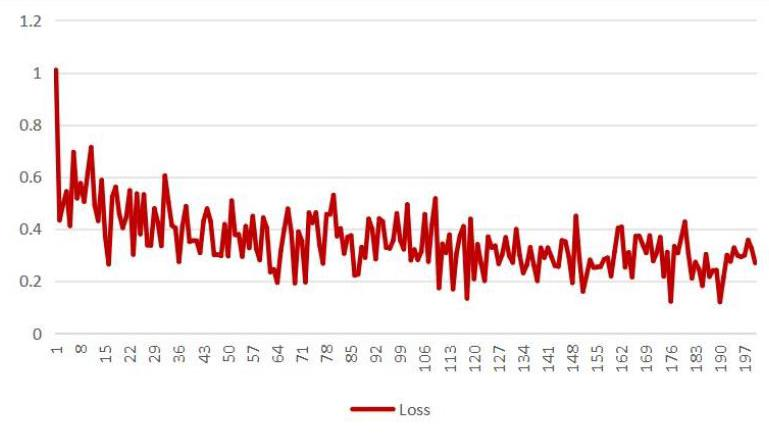

资料来源:Wind，华源证券研究所

根据上图结果, 我们可以看出虽然局部损失函数值有一定的波动, 但是全局来看损失函数下降过程较为平滑, 这个结果说明整个训练过程较为稳定。

### 3.2. 模型随机性影响

神经网络训练具有一定的随机性, 不同随机种子由于参数初始化、随机梯度下降的路径不同可能导致最终生成不同的信号和样本外策略不同的绩效表现。

为了探究随机性对最终结果造成的影响, 我们每次训练的时候平行训练十个 seed, 并且计算不同 seed 产生预测值的相关性如下: 上述相关系数矩阵可以看出:所有 seed 的预测值两两相关性大部分都在 70%以上，相对较高, 但最低相关性仅仅只有 59.48%, 说明模型存在一定的随机性, 但随机性对模型最终结果的影响可能有限。

图表 4: 不同 seed 预测值的相关性情况

<table><tr><td></td><td>seed0</td><td>seed1</td><td>seed2</td><td>seed3</td><td>seed4</td><td>seed5</td><td>seed6</td><td>seed7</td><td>seed8</td><td>seed9</td></tr><tr><td>seed0</td><td>100.00%</td><td>69.03%</td><td>74.95%</td><td>64.58%</td><td>70.70%</td><td>72.61%</td><td>67.59%</td><td>74.01%</td><td>77 87%</td><td>76.87%</td></tr><tr><td>seed1</td><td>69.03%</td><td>100.00%</td><td>79.50%</td><td>75.03%</td><td>77.04%</td><td>76.36%</td><td>79.07%</td><td>70.14%</td><td>73.49%</td><td>76.70%</td></tr><tr><td>seed2</td><td>74.95%</td><td>79.50%</td><td>100.00%</td><td>75.39%</td><td>78.26%</td><td>71.44%</td><td>76.23%</td><td>67.10%</td><td>70.30%</td><td>80.72%</td></tr><tr><td>seed3</td><td>64.58%</td><td>75.03%</td><td>75.39%</td><td>100.00%</td><td>76.60%</td><td>78.10%</td><td>73.25%</td><td>67.60%</td><td>63.60%</td><td>77.01%</td></tr><tr><td>seed4</td><td>70.70%</td><td>77.04%</td><td>78.26%</td><td>76.60%</td><td>100.00%</td><td>81.09%</td><td>78.98%</td><td>69.88%</td><td>76.98%</td><td>80.60%</td></tr><tr><td>seed5</td><td>72.61%</td><td>76.36%</td><td>71.44%</td><td>78.10%</td><td>81.09%</td><td>100.00%</td><td>77.67%</td><td>80.57%</td><td>72.88%</td><td>81.85%</td></tr><tr><td>seed6</td><td>67.59%</td><td>79.07%</td><td>76.23%</td><td>73.25%</td><td>78.98%</td><td>77.67%</td><td>100.00%</td><td>59.48%</td><td>69.34%</td><td>85.30%</td></tr><tr><td>seed7</td><td>74.01%</td><td>70.14%</td><td>67.10%</td><td>67.60%</td><td>69.88%</td><td>80.57%</td><td>59.48%</td><td>100.00%</td><td>71.46%</td><td>74.01%</td></tr><tr><td>seed8</td><td>77.87%</td><td>73.49%</td><td>70.30%</td><td>63.60%</td><td>76.98%</td><td>72.88%</td><td>69.34%</td><td>71.46%</td><td>100.00%</td><td>73.53%</td></tr><tr><td>seed9</td><td>76.87%</td><td>76.70%</td><td>80.72%</td><td>77.01%</td><td>80.60%</td><td>81.85%</td><td>85.30%</td><td>74.01%</td><td>73.53%</td><td>100.00%</td></tr></table>

资料来源:Wind，华源证券研究所

## 4. 策略样本外绩效表现

本节我们将各个 seed 产生的信号进行平均操作, 再将平均信号放到样本外回测绩效表现。 策略具体的构建方式:每天计算对未来 N 日各个指数的涨跌幅的预测值，并基于其正负号， 可以形成每日指数的多空信号:

- 若预测结果为正，则意味着模型根据当前特征 X 预测指数未来上涨可能性更高，则生成看多信号。

- 若预测结果为负，则意味着模型根据当前特征 X 预测指数未来下跌可能性更高，则生成看空信号。

我们将指数视作一个期货品种，既能做多也能做空，具体策略回测的设定如下:

- 回测区间:20200101~20251231；

- 交易价格:根据当日收盘得到的信号于次日收盘价进行买卖交易，不考虑交易费用；

- 多和空收益方式:若当日收盘信号做多则策略收益率为 T+2 收盘价除以 T+1 收盘价减 1， 若当日收盘信号做空则策略收益率为 T+1 收盘价除以 T+2 收盘价减 1;

- 调仓方式:每天观测信号是否发生切换，若发生切换则进行调仓，反之则持仓不变。

### 4.1. 中证 500 指数绩效表现

由于我们在构建信号的时候, 直接使用预测值的符号函数作为最终信号, 这可能导致震荡市场环境下信号反复切换带来较高的交易成本，因此首先我们讨论了策略对阈值(k)的敏感性,即策略平均预测值大于 $\mathrm{k}$ 才进行看多,小于 $- \mathrm{k}$ 则进行看空,介于 $- \mathrm{k}$ 到 $\mathrm{k}$ 之间则维持最近一天的预判，以下是不同 $\mathrm{k}$ 取值下多空策略的绩效表现:

图表 5: 中证 500 多空信号分布 (回测区间 20200101~20251231)

<table><tr><td>阈值(k)</td><td>年化收益</td><td>交易次数</td><td>胜率</td><td>最大回撤</td></tr><tr><td>0.00%</td><td>40.42%</td><td>378</td><td>54.71%</td><td>-16.31%</td></tr><tr><td>0.20%</td><td>43.21%</td><td>216</td><td>53.26%</td><td>-14.00%</td></tr><tr><td>0.40%</td><td>35.49%</td><td>126</td><td>53.20%</td><td>-30.49%</td></tr></table>

资料来源:Wind，华源证券研究所

上述结果可以看出阈值为 0%并非最优，适当提高阈值有助于提升策略表现以及交易成本， 如 k=0.2%的时候，策略年化收益相对 k=0%提升了 2.79pct，总交易次数下降了 162 次，最大回撤也有一定的改善。

下面我们展示 k=0.2%时，中证 500 指数多空信号分布以及多空策略绩效表现，其结果分别如下图所示: 通过上述回测结果我们可以看出:

图表 6: 中证 500 多空信号分布 (回测区间 20200101~20251231)

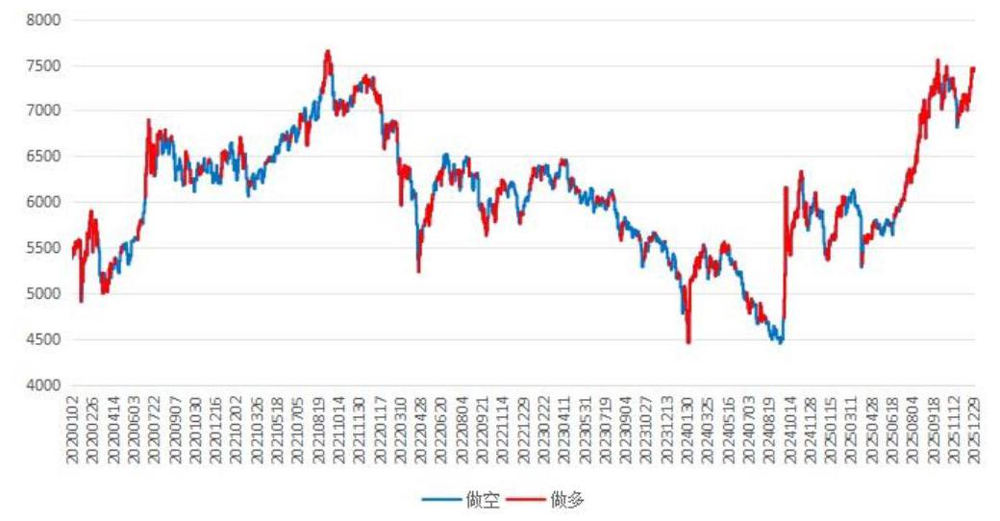

资料来源:Wind，华源证券研究所

图表 7: 中证 500 多空策略分年度表现 (回测区间 20200101~20251231)

<table><tr><td></td><td>年化收益</td><td>回撤区间</td><td>年化波动率</td><td>夏普比率</td><td>最大回撤</td><td>Calmar</td></tr><tr><td>2020</td><td>26.03%</td><td>2020-01-20 - 2020-02-04</td><td>25.23%</td><td>1.03</td><td>-13.61%</td><td>1.91</td></tr><tr><td>2021</td><td>6.88%</td><td>2021-03-24 - 2021-09-01</td><td>15.24%</td><td>0.45</td><td>-14.00%</td><td>0.49</td></tr><tr><td>2022</td><td>33.46%</td><td>2022-01-04 - 2022-03-15</td><td>21.67%</td><td>1.55</td><td>-10.84%</td><td>3.09</td></tr><tr><td>2023</td><td>44.09%</td><td>2023-07-24 - 2023-08-10</td><td>12.76%</td><td>3.47</td><td>-4.46%</td><td>9.89</td></tr><tr><td>2024</td><td>84.41%</td><td>2024-11-20 - 2024-12-27</td><td>28.30%</td><td>3.00</td><td>-13.55%</td><td>6.23</td></tr><tr><td>2025</td><td>84.76%</td><td>2025-10-09 - 2025-10-17</td><td>19.94%</td><td>4.25</td><td>-8.00%</td><td>10.60</td></tr><tr><td>年化</td><td>43.86%</td><td>2021-03-24 - 2021-09-01</td><td>21.21%</td><td>2.07</td><td>-14.00%</td><td>3.13</td></tr></table>

资料来源:Wind，华源证券研究所

图表 8:中证 500 多空策略净值走势 (回测区间 20200101~20251231)

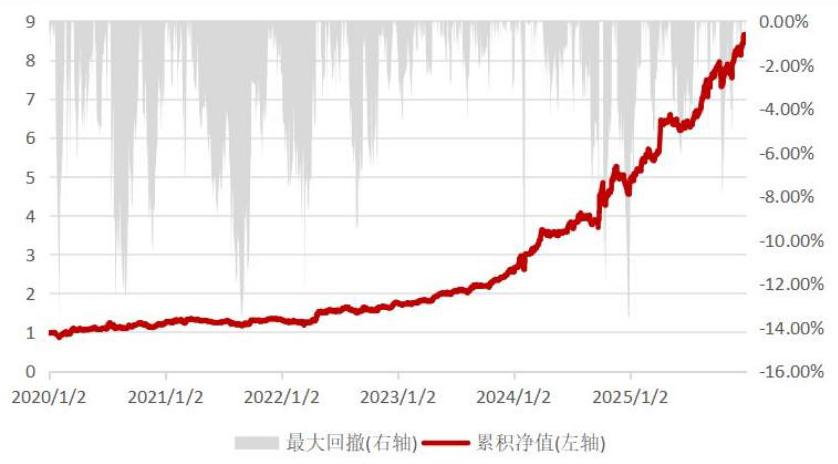

资料来源:Wind, 华源证券研究所

图表9: 中证 500 只做多绩效表现 (回测区间 20200101~20251231)

<table><tr><td></td><td>年化收益</td><td>回撤区间</td><td>年化波动率</td><td>夏普比李</td><td>最大回撤</td><td>Calmar</td></tr><tr><td>2020</td><td>22.29%</td><td>2020-01-20-2020-02-03</td><td>20.97%</td><td>1.06</td><td>-12.11%</td><td>1.84</td></tr><tr><td>2021</td><td>11.15%</td><td>2021-07-13 - 2021-07-28</td><td>10.10%</td><td>1.10</td><td>-6.19%</td><td>1.80</td></tr><tr><td>2022</td><td>3.13%</td><td>2022-01-04 - 2022-03-15</td><td>16.33%</td><td>0.19</td><td>-14.96%</td><td>0.21</td></tr><tr><td>2023</td><td>15.50%</td><td>2023-08-30 - 2023-10-16</td><td>6.65%</td><td>2.34</td><td>-2.96%</td><td>5.23</td></tr><tr><td>2024</td><td>39.46%</td><td>2024-01-25 - 2024-02-05</td><td>25.16%</td><td>1.58</td><td>-12.08%</td><td>3.27</td></tr><tr><td>2025</td><td>55.21%</td><td>2025-10-09 - 2025-10-17</td><td>14.61%</td><td>3.78</td><td>-7.53%</td><td>7.33</td></tr><tr><td>年化</td><td>23.30%</td><td>2021-12-16 - 2022-03-15</td><td>16.82%</td><td>1.39</td><td>-16.04%</td><td>1.45</td></tr></table>

资料来源:Wind，华源证券研究所

图表10:中证 500 只做空绩效表现 (回测区间 20200101~20251231)

<table><tr><td></td><td>年化收益</td><td>回撤区间</td><td>年化波动率</td><td>要普比率</td><td>最大回撤</td><td>Calmar</td></tr><tr><td>2020</td><td>3.06%</td><td>2020-03-18 - 2020-08-28</td><td>14.06%</td><td>0.22</td><td>-12.22%</td><td>0.25</td></tr><tr><td>2021</td><td>-3.84%</td><td>2021-03-24 - 2021-08-30</td><td>11.40%</td><td>-0.34</td><td>-14.30%</td><td>-0.27</td></tr><tr><td>2022</td><td>29.41%</td><td>2022-04-25 - 2022-07-04</td><td>14.27%</td><td>2.07</td><td>-7.05%</td><td>4.17</td></tr><tr><td>2023</td><td>24.76%</td><td>2023-01-04 - 2023-02-14</td><td>11.01%</td><td>2.26</td><td>-4.36%</td><td>5.68</td></tr><tr><td>2024</td><td>32.24%</td><td>2024-11-26 - 2024-12-27</td><td>13.29%</td><td>2.44</td><td>-7.03%</td><td>4.59</td></tr><tr><td>2025</td><td>19.04%</td><td>2025-04-07 - 2025-10-15</td><td>13.82%</td><td>1.38</td><td>-7.05%</td><td>2.70</td></tr><tr><td>年化</td><td>16.68%</td><td>2021-03-24 - 2021-08-30</td><td>13.04%</td><td>1.28</td><td>-14.30%</td><td>1.17</td></tr></table>

资料来源:Wind，华源证券研究所

图表 11: 中证 500 只做多净值走势 (回测区间 20200101~20251231)

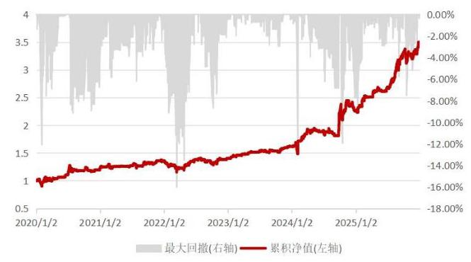

资料来源:Wind，华源证券研究所

图表 12: 中证 500 只做空净值走势 (回测区间 20200101~20251231)

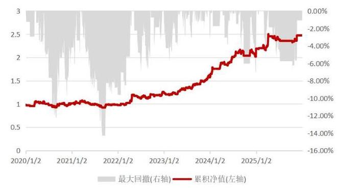

资料来源:Wind，华源证券研究所

1. 指数的多空信号切换频率和市场环境关联较大，指数单边行情的时候，模型信号不容易发生切换 (如图 6 中可以看出 2025 年 7 月 9 日至 10 月 14 日模型信号一直看多), 而指数震荡行情下，模型信号切换频率较高。而模型信号和模型本身的关联可能相对不大。

2. 策略的多空收益来源相对较为均衡, 只做多和只做空年化收益分别为 23.30%和 16.68%， 相差不大, 收益并不会大部分单纯来源于做多或做空。

3. 策略日度胜率较低，当阈值 k 取值为 0.2% 的时候，中证 500 指数日度胜率仅有 53.26%， 但策略整体的绝对收益较高, 这说明策略可能是获得了一个较高的赔率。

### 4.2. 中证 1000 指数绩效表现

首先我们也对中证 1000 择时策略不同阈值 k 对绩效结果的影响进行讨论, 以下是不同 k 取值下多空策略的绩效表现:

图表 13: 中证 1000 多空信号分布 (回测区间 20200101~20251231)

<table><tr><td>阈值(k)</td><td>年化收益</td><td>交易次数</td><td>胜率</td><td>最大回撤</td></tr><tr><td>0.00%</td><td>46.18%</td><td>394</td><td>54.30%</td><td>-22.41%</td></tr><tr><td>0.20%</td><td>50.47%</td><td>246</td><td>54.64%</td><td>-30.03%</td></tr><tr><td>0.40%</td><td>43.78%</td><td>166</td><td>54.02%</td><td>-20.13%</td></tr></table>

资料来源:Wind，华源证券研究所

上述结果可以看出，对于中证 1000 择时策略阈值为 0%也并非最优，适当提高阈值有助于提升策略表现以及交易成本，如 k=0.2%的时候，策略年化收益相对 k=0%提升了 4.29pct， 总交易次数下降了 148 次。

下面我们展示 k=0.2%时，中证 1000 指数多空信号分布以及多空策略绩效表现，其结果分别如下图所示: 上述回测结果我们可以看出:

图表 14: 中证 1000 多空信号分布 (回测区间 20200101~20251231)

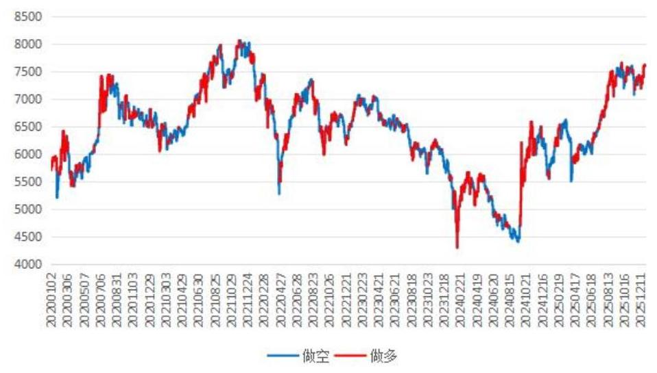

资料来源:Wind，华源证券研究所

图表 15: 中证 1000 多空策略分年度表现 (回测区间 20200101~20251231)

<table><tr><td></td><td>年化收益</td><td>回撤区间</td><td>年化波动率</td><td>夏普比率</td><td>最大回撤</td><td>Calmar</td></tr><tr><td>2020</td><td>18.81%</td><td>2020-10-13 - 2020-12-31</td><td>27.26%</td><td>0.69</td><td>-19.96%</td><td>0.94</td></tr><tr><td>2021</td><td>3.96%</td><td>2021-01-05 - 2021-01-21</td><td>18.88%</td><td>0.21</td><td>-10.70%</td><td>0.37</td></tr><tr><td>2022</td><td>93.63%</td><td>2022-08-23 - 2022-09-01</td><td>24.81%</td><td>3.80</td><td>-8.06%</td><td>11.62</td></tr><tr><td>2023</td><td>83.46%</td><td>2023-09-07 - 2023-10-12</td><td>14.40%</td><td>5.83</td><td>-4.77%</td><td>17.51</td></tr><tr><td>2024</td><td>71.31%</td><td>2024-01-25 - 2024-02-05</td><td>32.99%</td><td>2.17</td><td>-19.25%</td><td>3.71</td></tr><tr><td>2025</td><td>58.25%</td><td>2025-01-07 - 2025-02-06</td><td>22.35%</td><td>2.61</td><td>-13.35%</td><td>4.36</td></tr><tr><td>年化</td><td>51.21%</td><td>2020-10-13 - 2021-01-21</td><td>24.19%</td><td>2.12</td><td>-30.03%</td><td>1.71</td></tr></table>

资料来源:Wind，华源证券研究所

图表 16:中证 1000 多空策略净值走势(回测区间 20200101~20251231)

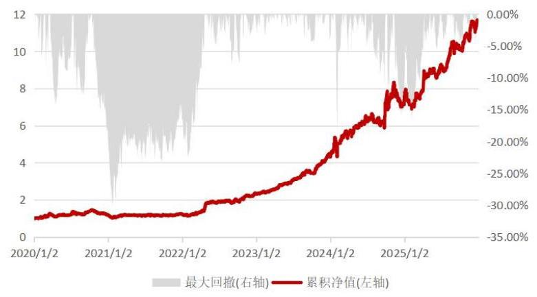

资料来源:Wind，华源证券研究所

图表 17: 中证 1000 只做多绩效表现 (回测区间 20200101~20251231)

<table><tr><td></td><td>年化收益</td><td>回撤区间</td><td>年化波动率</td><td>夏普比牵</td><td>最大回撤</td><td>Calmar</td></tr><tr><td>2020</td><td>17.94%</td><td>2020-10-13 - 2020-12-24</td><td>20.40%</td><td>0.88</td><td>-13.46%</td><td>1.33</td></tr><tr><td>2021</td><td>11.93%</td><td>2021-01-05 - 2021-02-05</td><td>13.55%</td><td>0.88</td><td>-10.39%</td><td>1.15</td></tr><tr><td>2022</td><td>23.22%</td><td>2022-08-23 - 2022-10-10</td><td>19.37%</td><td>1.20</td><td>-11.72%</td><td>1.98</td></tr><tr><td>2023</td><td>31.13%</td><td>2023-08-22 - 2023-08-25</td><td>8.44%</td><td>3.70</td><td>-3.61%</td><td>8.62</td></tr><tr><td>2024</td><td>31.67%</td><td>2024-01-25 - 2024-02-05</td><td>29.17%</td><td>1.09</td><td>-19.25%</td><td>1.65</td></tr><tr><td>2025</td><td>42.04%</td><td>2025-09-01 - 2025-09-04</td><td>12.67%</td><td>3.32</td><td>-6.13%</td><td>6.85</td></tr><tr><td>年化</td><td>26.00%</td><td>2020-10-13 - 2021-02-05</td><td>18.49%</td><td>1.41</td><td>-22.08%</td><td>1.18</td></tr></table>

资料来源:Wind，华源证券研究所

图表 18: 中证 1000 只做空绩效表现 (回测区间 20200101~20251231)

<table><tr><td></td><td>年化收益</td><td>回撤区间</td><td>年化波动率</td><td>夏普比率</td><td>最大回撤</td><td>Calmar</td></tr><tr><td>2020</td><td>0.73%</td><td>2020-03-18 - 2020-09-02</td><td>18.09%</td><td>0.04</td><td>-14.08%</td><td>0.05</td></tr><tr><td>2021</td><td>-7.13%</td><td>2021-03-25 - 2021-09-23</td><td>13.13%</td><td>-0.54</td><td>-14.10%</td><td>-0.51</td></tr><tr><td>2022</td><td>57.14%</td><td>2022-04-26 - 2022-08-18</td><td>15.78%</td><td>3.64</td><td>-9.35%</td><td>6.11</td></tr><tr><td>2023</td><td>39.91%</td><td>2023-12-26 - 2023-12-29</td><td>11.99%</td><td>3.34</td><td>-4.00%</td><td>9.97</td></tr><tr><td>2024</td><td>30.11%</td><td>2024-08-27 - 2024-12-11</td><td>15.66%</td><td>1.93</td><td>-12.09%</td><td>2.49</td></tr><tr><td>2025</td><td>11.41%</td><td>2025-01-06 - 2025-03-18</td><td>18.51%</td><td>0.62</td><td>-10.27%</td><td>1.11</td></tr><tr><td>年化</td><td>20.01%</td><td>2020-03-18 - 2021-09-23</td><td>15.73%</td><td>1.27</td><td>-19.85%</td><td>1.01</td></tr></table>

资料来源:Wind，华源证券研究所

图表 19: 中证 1000 只做多净值走势 (回测区间 20200101~20251231)

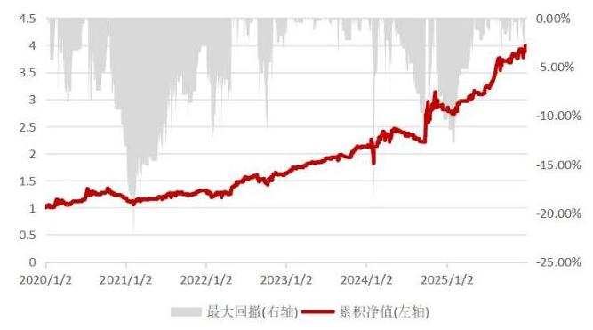

资料来源:Wind，华源证券研究所

图表20: 中证 1000 只做空净值走势 (回测区间 20200101~20251231)

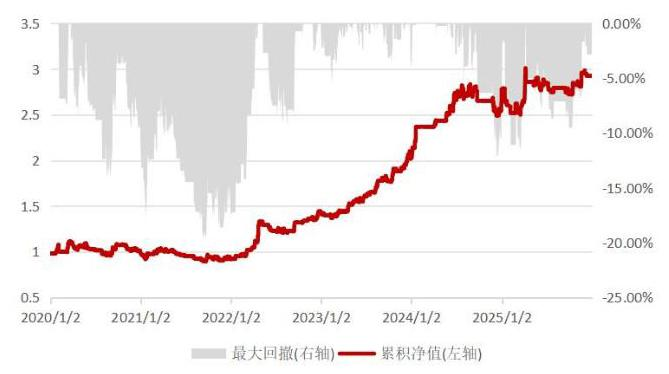

资料来源:Wind，华源证券研究所

1. 中证 1000 指数择时策略和中证 500 类似，模型只做多年化收益为 26%，只做空年化收益 20.01%，模型多空收益来源较为均衡；

2. 策略日度胜率不高, 但绝对收益表现良好, 只做多策略 2020 年至今每年均能获得正收益, 只做空策略除 2021 年外也每年均能获得正收益。

### 4.3. 其他宽基指数上的绩效表现

进一步我们还将策略应用在一些常见的宽基指数上, 如中证 2000、中证全指等, 其对应回测结果分别如下:

图表 21: 各宽基指数择时策略汇总表现 (回测区间 20200101~20251231)

<table><tr><td>宽基指数</td><td>年化收益</td><td>交易次数</td><td>胜率</td><td>最大回撤</td></tr><tr><td>中证2000</td><td>32.40%</td><td>246</td><td>59.95%</td><td>-25.59%</td></tr><tr><td>中证全指</td><td>18.74%</td><td>202</td><td>53.97%</td><td>-16.95%</td></tr></table>

资料来源:Wind，华源证券研究所

图表 22: 中证 2000 只做多绩效表现 (回测区间 20200101~20251231)

<table><tr><td></td><td>年化收益</td><td>回撤区间</td><td>年化波动率</td><td>夏普比率</td><td>最大回撤</td><td>Calmar</td></tr><tr><td>2020</td><td>17.49%</td><td>2020-10-13 - 2020-12-28</td><td>19.98%</td><td>0.88</td><td>-14.59%</td><td>1.20</td></tr><tr><td>2021</td><td>19.14%</td><td>2021-01-04 - 2021-02-08</td><td>13.91%</td><td>1.38</td><td>-12.50%</td><td>1.53</td></tr><tr><td>2022</td><td>33.35%</td><td>2022-08-23 - 2022-10-10</td><td>20.39%</td><td>1.64</td><td>-11.54%</td><td>2.89</td></tr><tr><td>2023</td><td>40.86%</td><td>2023-07-25 - 2023-08-25</td><td>9.50%</td><td>4.32</td><td>-3.94%</td><td>10.36</td></tr><tr><td>2024</td><td>33.12%</td><td>2024-01-25 - 2024-02-07</td><td>33.75%</td><td>0.99</td><td>-25.59%</td><td>1.29</td></tr><tr><td>2025</td><td>54.44%</td><td>2025-08-26 - 2025-09-04</td><td>14.16%</td><td>3.84</td><td>-6.21%</td><td>8.76</td></tr><tr><td>年化</td><td>32.56%</td><td>2024-01-25 - 2024-02-07</td><td>20.13%</td><td>1.62</td><td>-25.59%</td><td>1.27</td></tr></table>

图表 23: 中证全指只做多绩效表现 (回测区间 20200101~20251231)

<table><tr><td></td><td>年化收益</td><td>回撤区间</td><td>年化波动率</td><td>夏普比率</td><td>最大回撤</td><td>Calmar</td></tr><tr><td>2020</td><td>27.63%</td><td>2020-07-13 - 2020-12-28</td><td>17.24%</td><td>1.60</td><td>-10.37%</td><td>2.66</td></tr><tr><td>2021</td><td>1.16%</td><td>2021-02-19 - 2021-07-28</td><td>10.37%</td><td>0.11</td><td>-9.34%</td><td>0.12</td></tr><tr><td>2022</td><td>12.78%</td><td>2022-07-28 - 2022-10-10</td><td>13.99%</td><td>0.92</td><td>-9.37%</td><td>1.36</td></tr><tr><td>2023</td><td>9.36%</td><td>2023-06-16 - 2023-06-26</td><td>7.85%</td><td>1.20</td><td>-3.92%</td><td>2.39</td></tr><tr><td>2024</td><td>32.61%</td><td>2024-10-08 - 2024-12-31</td><td>22.41%</td><td>1.46</td><td>-11.78%</td><td>2.77</td></tr><tr><td>2025</td><td>33.02%</td><td>2025-09-01 - 2025-09-04</td><td>13.00%</td><td>2.54</td><td>-4.63%</td><td>7.13</td></tr><tr><td>年化</td><td>18.83%</td><td>2024-10-08 - 2025-01-13</td><td>14.90%</td><td>1.26</td><td>-16.95%</td><td>1.11</td></tr></table>

资料来源:Wind，华源证券研究所

图表24: 中证 2000 只做多净值走势 (回测区间 20200101~20251231)

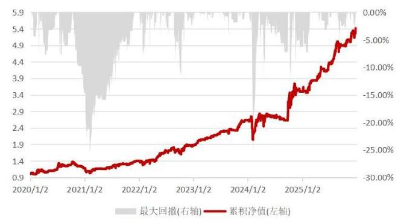

资料来源:Wind，华源证券研究所

图表 25: 中证全指只做多净值走势 (回测区间 20200101~20251231)

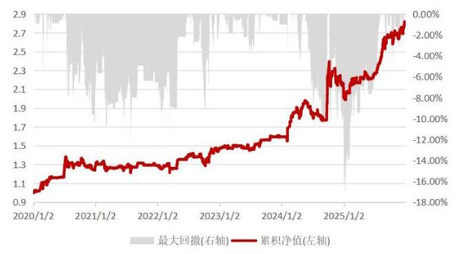

资料来源:Wind，华源证券研究所

通过上述回测结果我们可以看出:

1. 该策略在中证 2000 和中证全指上均有较好的择时效果，只做多策略在这两个指数上每年均能获得正超额，策略在整个回测区间内的夏普比率和 Calmar 比均超过了 1。

2. 该策略在中证 2000 上的表现优于中证 1000 优于中证 500 , 这意味着策略可能在市值更小的宽基指数上表现更好。

3. 中证 2000 和中证 1000 指数的择时策略通常会在 2024 年 1 月下旬至 2 月初出现较大的回撤。

## 5. 结论

本文基于指数量价数据使用稀疏自编码器模型搭建了一套宽基指数的择时模型，数据预处理阶段，新模型通过对时间序列数据进行时序标准化和小波变换降低数据中的噪声含量。 模型训练阶段, 我们通过给自编码模型的损失函数上添加自回归损失和稀疏化惩罚达到以下目标:

1)模型能够自助进行特征筛选和信息提纯。

2)提高模型鲁棒性和抗过拟合能力。

3)模型能够较好的学习到指数涨跌的“真实”规律。

通过绘制损失函数与迭代步数变化曲线以及不同随机种子产生信号的两两相关性矩阵， 我们可以得出结论:

1) 虽然局部损失函数值有一定的波动, 但是全局来看损失函数下降过程较为平滑, 这个结果说明整个训练过程较为稳定。

2)所有随机种子的预测值两两相关性大部分都在 70%以上，相对较高，但最低相关性仅仅只有 59.48%，说明模型存在一定的随机性，但随机性对模型最终结果的影响可能有限。

根据合成信号在样本外的表现我们可以得出结论:

1)指数的多空信号切换频率和市场环境关联较大，指数单边行情的时候，模型信号不容易发生切换 ( 如图 6 中可以看出 2025 年 7 月 9 日至 10 月 14 日模型信号一直看多 )，而指数震荡行情下，模型信号切换频率较高。而模型信号和模型本身的关联可能相对不大。

2)由于我们在构建信号的时候，我们发现设定适当的阈值(k)有助于提升策略的稳定性，并且也能大幅降低策略的换手次数。

3)各个宽基指数上策略的多空收益来源相对较为均衡，只做多和只做空年化收益相差不大, 策略收益并不会大部分单纯来源于做多或做空。

4)策略日度胜率相对较低，均位于 50%~60%，但策略绝对收益较高，这说明策略可能是获得了一个较高的赔率。

5)该策略在中证 2000 上的表现优于中证 1000 优于中证 500，这意味着策略可能在市值更小的宽基指数上表现更好。

新模型在中证 500、中证 1000、中证 2000 和中证全指上均有较好的业绩表现，各年度多空策略以及只做多策略收益均为正, 其中中证 500 和中证 1000 多空策略年化收益分别为 43.86% 和 51.21%，中证 500、中证 1000、中证 2000 和中证全指只做多策略收益分别为 23.30%、26.00%、32.56%、18.83%。

## 6. 参考文献

[1] Bao W, Yue J, Rao Y. A deep learning framework for financial time series using stacked autoencoders and long-short term memory[J]. PloS one, 2017, 12(7): e0180944.

[2] 邱锡鹏 神经网络与机器学习 p216~p220

## 7. 风险提示

1)量化模型基于历史数据分析，未来存在失效风险，建议投资者紧密跟踪模型表现。

2)极端市场环境可能对模型效果造成剧烈冲击，导致收益亏损。

## 证券分析师声明

本报告署名分析师在此声明，本人具有中国证券业协会授予的证券投资咨询执业资格并注册为证券分析师，本报告表述的所有观点均准确反映了本人对标的证券和发行人的个人看法。本人以勤勉的职业态度，专业审慎的研究方法，使用合法合规的信息，独立、客观的出具此报告，本人所得报酬的任何部分不曾与、不与，也不将会与本报告中的具体投资意见或观点有直接或间接联系。

## 一般声明

华源证券股份有限公司(以下简称 “本公司”)具有中国证监会许可的证券投资咨询业务资格。

本报告是机密文件，仅供本公司的客户使用。本公司不会因接收人收到本报告而视其为本公司客户。本报告是基于本公司认为可靠的已公开信息撰写，但本公司不保证该等信息的准确性或完整性。本报告所载的资料、工具、意见及推测等只提供给客户作参考之用，并非作为或被视为出售或购买证券或其他投资标的的邀请或向人作出邀请。该等信息、意见并未考虑到获取本报告人员的具体投资目的、财务状况以及特定需求， 在任何时候均不构成对任何人的个人推荐。客户应对本报告中的信息和意见进行独立评估，并应同时考量各自的投资目的、财务状况和特殊需求，必要时就法律、商业、财务、税收等方面咨询专家的意见。对依据或使用本报告所造成的一切后果，本公司及/或其关联人员均不承担任何法律责任。任何形式的分享证券投资收益或者分担证券投资损失的书面或口头承诺均为无效。

本报告所载的意见、评估及推测仅反映本公司于发布本报告当日的观点和判断，在不同时期，本公司可发出与本报告所载意见、评估及推测不一致的报告。本报告所指的证券或投资标的的价格、价值及投资收入可能会波动。除非另行说明，本报告中所引用的关于业绩的数据代表过往表现, 过往的业绩表现不应作为日后回报的预示。本公司不承诺也不保证任何预示的回报会得以实现, 分析中所做的预测可能是基于相应的假设, 任何假设的变化可能会显著影响所预测的回报。本公司不保证本报告所含信息保持在最新状态。本公司对本报告所含信息可在不发出通知的情形下做出修改, 投资者应当自行关注相应的更新或修改。

本报告的版权归本公司所有，属于非公开资料。本公司对本报告保留一切权利。未经本公司事先书面授权，本报告的任何部分均不得以任何方式修改、复制或再次分发给任何其他人，或以任何侵犯本公司版权的其他方式使用。如征得本公司许可进行引用、刊发的，需在允许的范围内使用，并注明出处为 “华源证券研究所”，且不得对本报告进行任何有悖原意的引用、删节和修改。本公司保留追究相关责任的权利。所有本报告中使用的商标、服务标记及标记均为本公司的商标、服务标记及标记。

本公司销售人员、交易人员以及其他专业人员可能会依据不同的假设和标准，采用不同的分析方法而口头或书面发表与本报告意见及建议不一致的市场评论或交易观点，本公司没有就此意见及建议向报告所有接收者进行更新的义务。本公司的资产管理部门、自营部门以及其他投资业务部门可能独立做出与本报告中的意见或建议不一致的投资决策。

## 信息披露声明

在法律许可的情况下，本公司可能会持有本报告中提及公司所发行的证券并进行交易，也可能为这些公司提供或争取提供投资银行、财务顾问和金融产品等各种金融服务。本公司将会在知晓范围内依法合规的履行信息披露义务。因此，投资者应当考虑到本公司及/或其相关人员可能存在影响本报告观点客观性的潜在利益冲突, 投资者请勿将本报告视为投资或其他决定的唯一参考依据。

## 投资评级说明

证券的投资评级:以报告日后的 6 个月内，证券相对于同期市场基准指数的涨跌幅为标准，定义如下:

买入:相对同期市场基准指数涨跌幅在 20%以上；

增持:相对同期市场基准指数涨跌幅在 5%~20%之间；

中性:相对同期市场基准指数涨跌幅在 -5%~+5%之间；

减持:相对同期市场基准指数涨跌幅低于-5%及以下。

无:由于我们无法获取必要的资料，或者公司面临无法预见结果的重大不确定性事件，或者其他原因，致使我们无法给出明确的投资评级。

行业的投资评级:以报告日后的 6 个月内，行业股票指数相对于同期市场基准指数的涨跌幅为标准，定义如下:

看好:行业股票指数超越同期市场基准指数；

中性:行业股票指数与同期市场基准指数基本持平；

看淡:行业股票指数弱于同期市场基准指数。

我们在此提醒您，不同证券研究机构采用不同的评级术语及评级标准。我们采用的是相对评级体系，表示投资的相对比重建议；

投资者买入或者卖出证券的决定取决于个人的实际情况，比如当前的持仓结构以及其他需要考虑的因素。投资者应阅读整篇报告，以获取比较完整的观点与信息, 不应仅仅依靠投资评级来推断结论。

本报告采用的基准指数:A 股市场(北交所除外)基准为沪深 300 指数，北交所市场基准为北证 50 指数，香港市场基准为恒生中国企业指数(HSCEI)，美国市场基准为标普 500 指数或者纳斯达克指数，新三板基准指数为三板成指(针对协议转让标的)或三板做市指数(针对做市转让标的)。